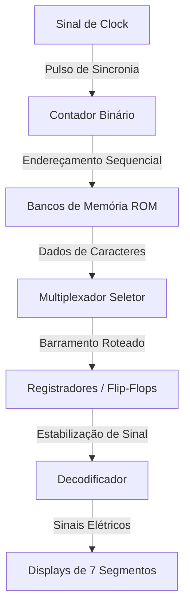
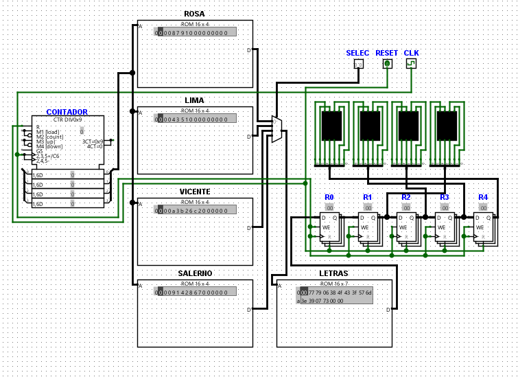

# ⚡ Circuito Lógico Customizado — Modelagem e Simulação no Logisim

> Projeto de arquitetura de hardware digital customizada simulada no Logisim-Evolution, contendo caminhos de dados (Datapath), memórias de decodificação de caracteres e unidade de controle sequencial.

---

## 📋 Visão Geral e Contexto de Engenharia

Este projeto representa os fundamentos da engenharia de processamento computacional moderno. Trata-se da simulação de uma arquitetura de hardware dedicada que implementa caminhos de dados (*Datapath*) governados por uma unidade de controle lógica. 

No mundo real da eletrônica digital e sistemas microprocessados, este modelo representa exatamente como memórias RAM, multiplexadores e registradores operam a nível físico de silício antes de serem transpostos para chips programáveis (FPGAs) ou ASICs.

O circuito lê dados binários salvos de forma estática em bancos de memória, roteia e armazena temporariamente essa informação em registradores sob a cadência de um sinal de clock elétrico, decodificando e renderizando caracteres (letras e números) em displays visuais.

---

## 🛠️ Tecnologias e Componentes Chave do Circuito

### Ferramenta de Simulação
* **Logisim-Evolution:** Software livre baseado em Java para desenho esquemático e simulação de circuitos lógicos. É o degrau anterior e fundamental antes do desenvolvimento em linguagens estruturadas de descrição de hardware profissionais (HDLs como VHDL ou Verilog).

### Arquitetura de Componentes
1. **Contador Binário (CONTADOR CTR DIV0x9):** Funciona como gerador sequencial de endereços, fornecendo a indexação binária contínua que dita o fluxo do programa.
2. **Memórias ROM (Módulos ROSA, LIMA, VICENTE, SALERNO):** Memórias estáticas não voláteis pré-programadas. Cada partição armazena a codificação hexadecimal/binária para projetar caracteres alfanuméricos específicos associados.
3. **Multiplexador (MUX):** Atua como uma chave seletora digital rápida de dados ($N \to 1$). O MUX escolhe de qual barramento de memória ROM a informação deve ser extraída com base em chaves e sinais seletores de controle, evitando conflitos de barramento.
4. **Registradores / Flip-Flops (R0 a R4):** Memórias internas temporárias síncronas e voláteis de altíssima velocidade que capturam e estabilizam os barramentos de bits na borda ativa do pulso de Clock elétrico (CLK).
5. **Decodificadores e Displays de 7 Segmentos:** Unidades de exibição física que convertem dados digitais brutos em sinais elétricos discretos que iluminam os segmentos adequados para legibilidade humana.

---

## 📐 Arquitetura e Fluxo de Dados

O circuito opera seguindo os preceitos de uma **Máquina de Estados Finitos (FSM) baseada em ROM**:

1. O **Clock (CLK)** oscila, enviando pulsos periódicos estáveis.
2. O **Contador** incrementa de forma assíncrona, sinalizando o próximo bloco de instrução.
3. O **Multiplexador (MUX)** roteia dinamicamente os barramentos de dados ativos da ROM selecionada.
4. O barramento de dados é estabilizado e capturado pelos **Registradores** na transição de clock, enviando os dados para decodificação.
5. Os **Displays de 7 segmentos** acendem os caracteres finais mapeados.

---

## 📊 Visualização do Circuito

Abaixo está o diagrama esquemático completo da arquitetura criada no Logisim:

---

## 🚀 Como Abrir e Simular

1. Instale o ambiente de execução [Java JDK 11 ou superior](https://adoptium.net/).
2. Faça o download da versão executável do [Logisim-Evolution](https://github.com/logisim-evolution/logisim-evolution).
3. Abra o Logisim e carregue o circuito do projeto:
   - `File > Open > TRABALHO.circ`
4. Habilite a oscilação automática do Clock elétrico para simular em tempo real:
   - `Simulate > Auto-Tick Enabled`
